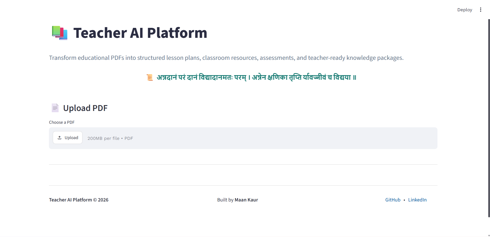
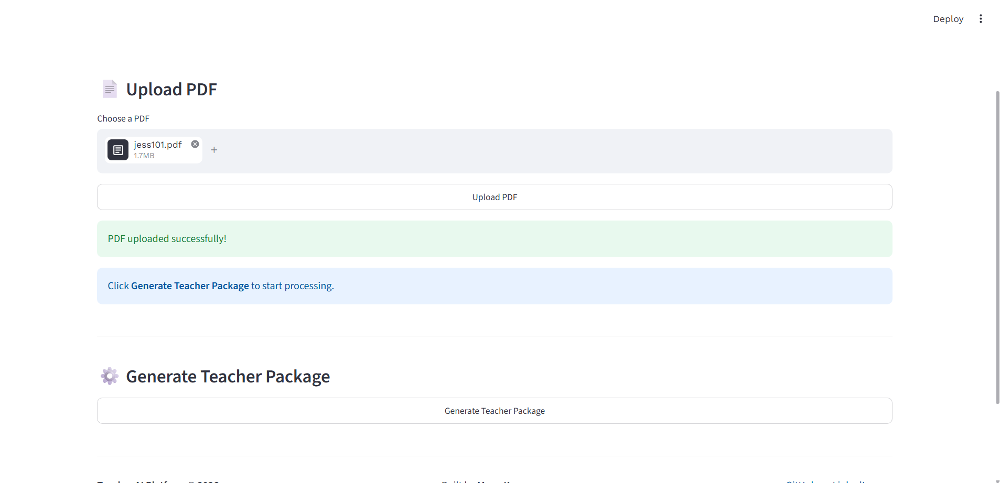
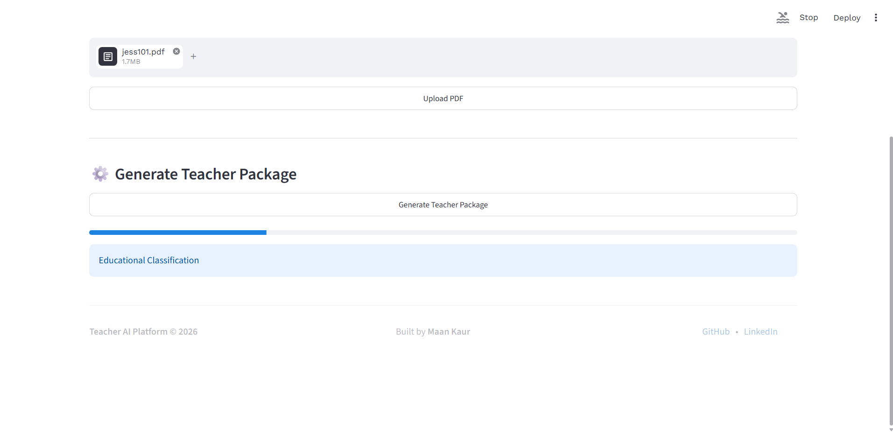
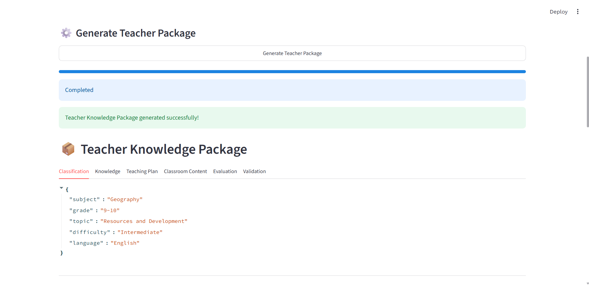
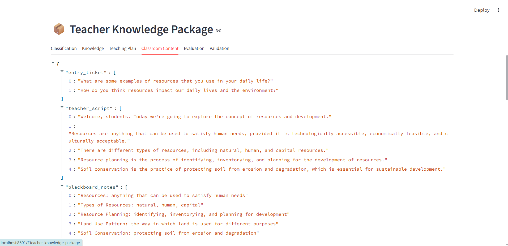
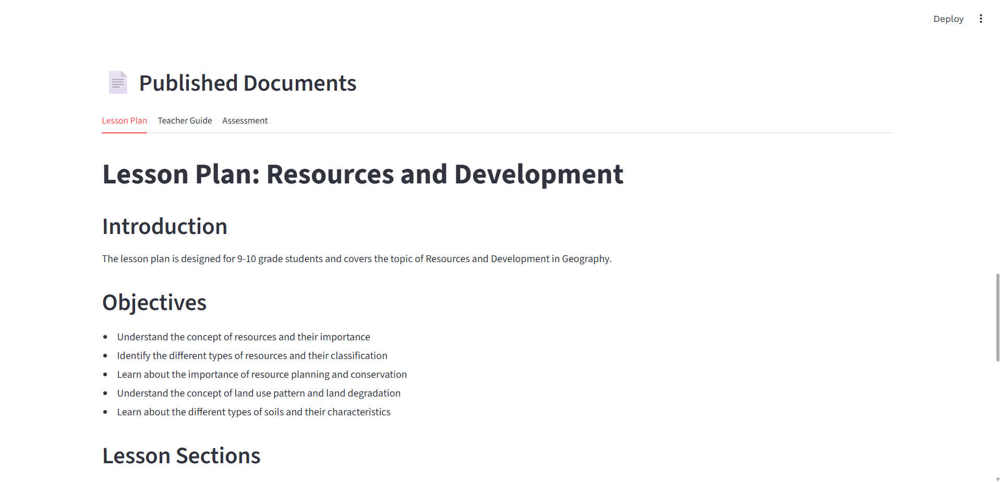
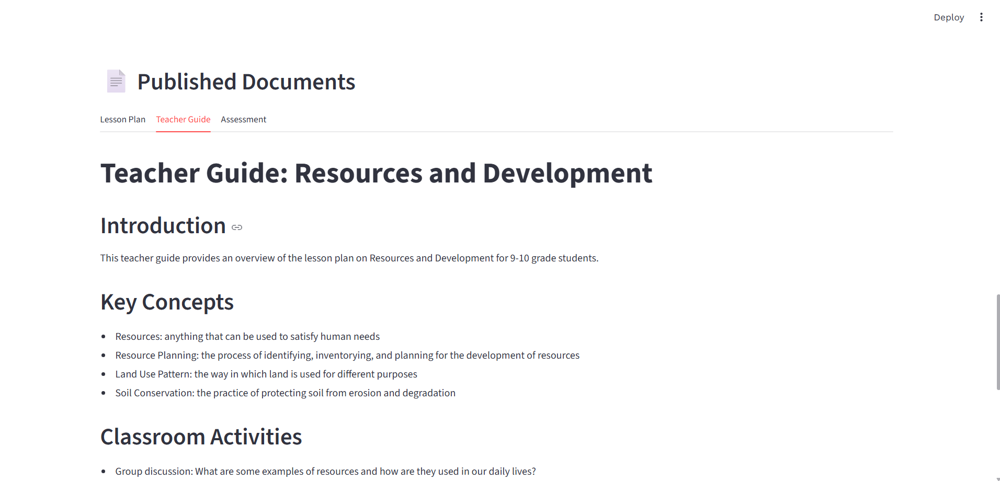
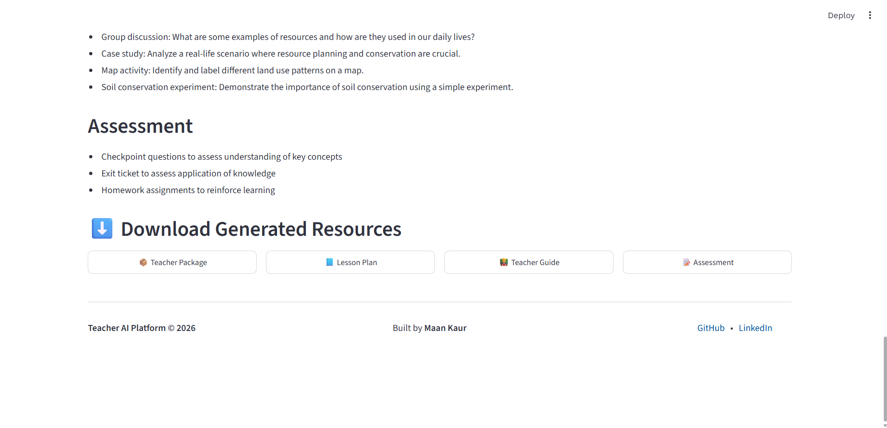

# 📚 Teacher AI Platform

Transform educational PDFs into structured lesson plans, classroom resources, assessments, and teacher-ready knowledge packages using a multi-agent AI pipeline.

---

## 🌐 Live Demo

**Teacher AI Platform:**  
[Teacher-AI-Platform](https://your-deployed-app-url)

---

## 📸 Screenshots

### Home Page
#### 1

#### 2 


### Generated Teacher Knowledge Package
#### 3

#### 4

#### 5


### Generated Classroom Resources
#### 6

#### 7


### Download Generated Resources
#### 8


---

# ✨ Features

- Upload educational PDF documents through a simple Streamlit interface
- Parse PDFs into structured Markdown and raw text using PyMuPDF4LLM
- Automatic educational classification (subject, grade, topic, difficulty, language)
- AI-powered knowledge extraction
- AI-generated lesson planning
- Classroom-ready instructional content generation
- Assessment generation including MCQs, short-answer questions, and learning gap analysis
- Rule-based validation of generated educational content
- Real-time processing progress tracking
- Download generated resources as:
  - TeacherKnowledgePackage.json
  - Lesson Plan (Markdown)
  - Teacher Guide (Markdown)
  - Assessment (Markdown)

---

# 🏗 High-Level Architecture

```text
                     PDF Upload
                          │
                          ▼
               PyMuPDF4LLM Document Parser
                          │
                          ▼
          Educational Classification Agent
                          │
                          ▼
             Knowledge Extraction Agent
                          │
                          ▼
              Teaching Planner Agent
                          │
                          ▼
            Classroom Content Agent
                          │
                          ▼
                 Evaluation Agent
                          │
                          ▼
                 Validation Agent
                          │
                          ▼
                  Publisher Agent
                          │
          ┌───────────────┼────────────────┐
          ▼               ▼                ▼
 Teacher Package     Lesson Plan md     Assessment md
      JSON           Teacher Guide md
                          │
                          ▼
                 Streamlit Frontend
```

---

## 🤖 AI Orchestration

The Teacher AI Platform uses a **custom multi-agent orchestration pipeline** implemented in Python. Instead of relying on orchestration frameworks such as LangChain or LlamaIndex, the system coordinates a sequence of specialized AI agents through a central `PipelineOrchestrator`.

Each agent performs a single educational task and produces structured JSON output, which becomes the input for the next stage of the pipeline. All AI agents use the **Groq API** with the **Llama 3.3 70B Versatile** model to generate structured educational content.

To ensure reliable communication between agents, the system uses **Pydantic schemas**, providing strongly typed data exchange, validation, and consistency throughout the pipeline.

This modular architecture improves maintainability, readability, testing, and future extensibility.

### Pipeline Flow

1. **PDF Parsing & Document Intelligence**
   - Parses uploaded PDF documents using **PyMuPDF4LLM**.
   - Extracts document metadata, raw text, page-wise content, and Markdown.

2. **Educational Classification Agent**
   - Identifies:
     - Subject
     - Grade
     - Topic
     - Difficulty level
     - Language

3. **Knowledge Extraction Agent**
   - Extracts:
     - Learning objectives
     - Prerequisites
     - Key concepts
     - Educational keywords

4. **Teaching Planner Agent**
   - Creates a structured classroom lesson plan with instructional sections and estimated durations.

5. **Classroom Content Agent**
   - Produces classroom-ready teaching materials including:
     - Entry tickets
     - Teacher scripts
     - Blackboard notes
     - Classroom activities
     - Checkpoint questions
     - Exit tickets
     - Homework
     - Mentor moment

6. **Evaluation Agent**
   - Generates:
     - Classroom activities
     - Multiple-choice questions
     - Short-answer questions
     - Learning gap analysis

7. **Validation Agent**
   - Performs rule-based validation to verify that all essential educational components are present in the generated Teacher Knowledge Package.

8. **Publisher Agent**
   - Converts the structured Teacher Knowledge Package into polished Markdown documents:
     - Lesson Plan
     - Teacher Guide
     - Assessment

The `PipelineOrchestrator` manages the execution order, coordinates data flow between agents, tracks processing progress, and produces the final Teacher Knowledge Package together with downloadable classroom resources.

---

# 🛠 Tech Stack

## Backend

- FastAPI
- Python
- Groq API
- Llama 3.3 70B Versatile
- PyMuPDF
- PyMuPDF4LLM
- Pydantic

## Frontend

- Streamlit
- Requests

---

# 📁 Project Structure

```
backend/
    app/
        agents/
        api/
        parsers/
        pipeline/
        prompts/
        schemas/
        utils/

frontend/
    components/
    api/
    app.py

samples/
```

---

# 🚀 Setup instructions to run the project locally.

## 1. Clone the repository

```bash
git clone https://github.com/hoomaancodes/teacher-ai-platform.git

cd teacher-ai-platform
```

---

## 2. Backend

```bash
cd backend

pip install -r requirements.txt
```

Create a `.env` file:

```text
GROQ_API_KEY=your_groq_api_key
```

Start the backend server:

```bash
uvicorn app.main:app --reload
```

Backend runs on:

```
http://127.0.0.1:8000
```

---

## 3. Frontend

Open another terminal.

```bash
cd frontend

streamlit run app.py
```

The application will open in your browser.

---

# 📡 API Endpoints

| Method | Endpoint | Description |
|----------|----------|-------------|
| POST | `/upload` | Upload PDF |
| POST | `/process/{job_id}` | Start AI pipeline |
| GET | `/progress/{job_id}` | Track processing progress |
| GET | `/result/{job_id}` | Retrieve generated Teacher Knowledge Package |

---

# 📄 Output Files

The application generates:

- TeacherKnowledgePackage.json
- LessonPlan.md
- TeacherGuide.md
- Assessment.md

---

# 🔮 Future Improvements

- OCR support for scanned and image-based PDFs
- Batch processing of multiple educational documents
- Export generated resources to PDF and Microsoft Word formats
- User authentication and personal workspaces
- Persistent cloud storage using a database
- Enhanced UI with themes, animations, and responsive layouts
---